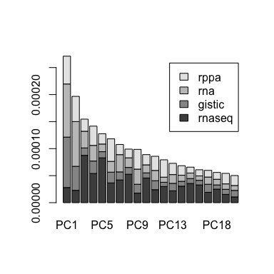
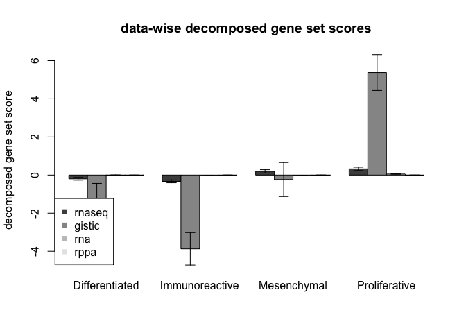
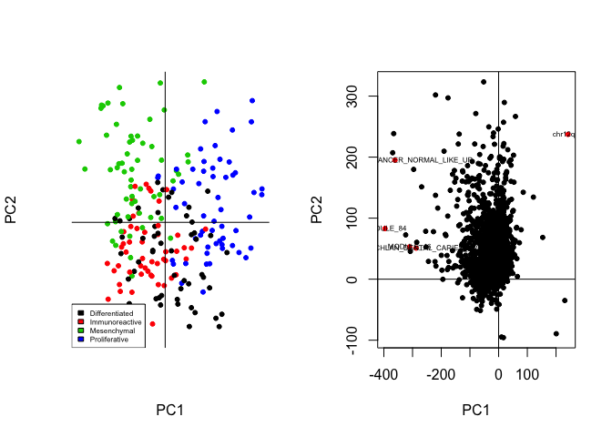
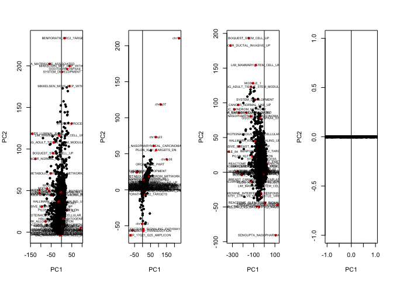

# Multi-dataset GO geneset data analysis of TCGA Ovarian Cancer Data and post-mogsa filtering with goProfiles
Aedin Culhane  (aedin@jimmy.harvard.edu)  
Nov 24 2015  


#  Load Example DataSet
The ovarian TCGA  [TCGA data portal here](https://tcga-data.nci.nih.gov/tcga/) data were downlaoded  from the firehose data [firehose_get](https://confluence.broadinstitute.org/display/GDAC/Download) pipeline. Code to downlaod and generate the data is below

Load the data set, its called se.rda.  Check that the sampleNames are consistent between assays.


```r
require(dplyr)
```

```
## Loading required package: dplyr
## 
## Attaching package: 'dplyr'
## 
## The following objects are masked from 'package:GSEABase':
## 
##     intersect, setdiff, union
## 
## The following object is masked from 'package:graph':
## 
##     union
## 
## The following object is masked from 'package:mogsa':
## 
##     combine
## 
## The following object is masked from 'package:AnnotationDbi':
## 
##     select
## 
## The following objects are masked from 'package:IRanges':
## 
##     collapse, desc, intersect, setdiff, slice, union
## 
## The following objects are masked from 'package:S4Vectors':
## 
##     intersect, rename, setdiff, union
## 
## The following object is masked from 'package:Biobase':
## 
##     combine
## 
## The following objects are masked from 'package:BiocGenerics':
## 
##     combine, intersect, setdiff, union
## 
## The following objects are masked from 'package:stats':
## 
##     filter, lag
## 
## The following objects are masked from 'package:base':
## 
##     intersect, setdiff, setequal, union
```

```r
ss<-function(x, na.rm=TRUE) {
      mean= mean(x, na.rm=na.rm)
      median= median(x, na.rm=na.rm)
      min= min(x, na.rm=na.rm)
      max= max(x, na.rm=na.rm)
      return(c(round(c(mean=mean, median=median, min=min, max=max),2), nrow=nrow(x), ncol=ncol(x) ))
    }
```


```r
#library(mogsa_goprofiles)
#data(se)
load("../data/se.rda")
sapply(se, function(x) exprs(x) %>% ss)
```

```
##         rnaseq gistic     rna   rppa
## mean      6.88      0    5.75  -0.13
## median    6.75      0    5.58  -0.19
## min       0.00     -2    1.84  -5.99
## max      23.50      2   14.30   9.67
## nrow   2191.00   3523 2751.00 165.00
## ncol    225.00    225  225.00 225.00
```


```r
sapply(lapply(se, sampleNames), identical, sampleNames(se[[1]]))
length(unique(lapply(se, sampleNames)))
```

# Review of basic functions in mogsa

Using the package mogsa, we apply integrative dimension reduction methods, MFA using the moa() function. 

  
The function moa() performs multiple factor analysis (MFA) (Abdi et al., 2013) or STATIS (Abdi et al., 2012). MFA projects the observations  and variables (genes) from each dataset onto a lower dimensional space, resulting in sample scores (or PCs) and  variables loadings respectively. 

In **MFA** the rows of each dataset are first centered and scaled, then each dataset is weighted by the reverse of its first eigenvalue (proc.row="center_ssq1", w.data="lambda1"). 

If **statis=TRUE**, the statis algorithm will be used, that is, each dataset will be further weighted so that datasets closer to the overall structure will receive a higher weight.


In this function, the input argument 

* proc.row :    preprocessing of rows 
* w.data   :    weight of datasets.     
* statis   :  multiple table analysis method to be used. 

To run multiple factorial analysis (MFA), set statis=FALSE (the default setting). 


```r
require(mogsa)
moa(lapply(se, exprs), proc.row = "center_ssq1", w.data = "inertia" )
```


In addition the R package mogsa can be used to perform consensus PCA (CPCA), generalized CCA (GCCA) and multiple co-inertia analsyis (MCIA) using the function  mbpca().  The method applied is defined using the parameter "method""	where;
  

```r
mbpca(lapply(se, exprs), ncomp=10, method="globalScore")  # cPCA
mbpca(lapply(se, exprs), ncomp=10, method="blockScore")  # GCCA
mbpca(lapply(se, exprs), ncomp=10, method="blockLoading")  # MCIA
```


moa will returns an S4 object with class "moa"


The object include

* **eig**: eigen values
* **tau**: The percentage of explained variance by each datasets sparately.
* **partial.eig**: matrix, rows indicate the partial eigenvalues from each data.
* **eig.vec**: a matrix, eigenvectors.

* **RV**: pairwise RV coefficients

* **loading**: the coordinate of variables/features.
* **fac.scr**: factor score of observations.
* **partial.fs**: partial factor score.


* **ctr.obs**: contribution of each observation to the total factor score.
* **ctr.var**: contribution of each variables to the total variance.
* **ctr.tab**: contribution of each data to the total variance.


To extract results: 


```r
slot(se.moa, "partial.eig")[, 1:6] # extract the eigenvalue for each dataset
slot(se.moa, "eig")[1:6] # extract the global eigenvalue
slot(se.moa, "RV")
```


To extract the global scores (of the observations) or the loadings or coefficients of the features of each dataset, we use or moaScores, moaCoef.


```r
scr<-moaScore(se.moa)
features<-moaCoef(se.moa)
```


#  Preparation of genesets 

Preparation of GO genesets 

## Mapped to Entrez GeneIDs (via org.Hs.eg.db)


```r
#library(graphite)
#keggdb <- prepGraphite(db = pathways("hsapiens", "kegg"), id = "symbol")


#GeneSet(GOCollection(c("GO:0005488", "GO:0019825"), evidenceCode="IDA"),geneIdType=EntrezIdentifier("org.Hs.eg.db"),setName="Sample GO Collection")

EntrezGeneIDs<-keys(org.Hs.eg.db)

# Mapped to All EntrezGeneIDs
gsc <- GeneSetCollection(EntrezGeneIDs,
        idType=AnnotationIdentifier("org.Hs.eg.db"),
        setType=GOCollection(ontology="BP"))


#GeneSetCollection(..,setType=GOCollection(evidenceCode="IMP"))
#goId %in% names(gsc[lapply(mget(names(gsc), GOTERM), Ontology) == "MF"])
#goId %in% names(gsc[lapply(mget(names(gsc), GOTERM), Ontology) == "BP"])

# Subset to genesets with >2 
idx <- sapply(gsc, function(x) length(geneIds(x))) > 2  
length(idx)

# View distribution of gene set lengths
tt<-sapply(gsc, function(x) length(geneIds(x)))
hist(tt)
summary(tt)

# View Distribution of geneset lengths
```


## Converting between Identifiers


```r
keytypes(org.Hs.eg.db)
```

```
##  [1] "ACCNUM"       "ALIAS"        "ENSEMBL"      "ENSEMBLPROT" 
##  [5] "ENSEMBLTRANS" "ENTREZID"     "ENZYME"       "EVIDENCE"    
##  [9] "EVIDENCEALL"  "GENENAME"     "GO"           "GOALL"       
## [13] "IPI"          "MAP"          "OMIM"         "ONTOLOGY"    
## [17] "ONTOLOGYALL"  "PATH"         "PFAM"         "PMID"        
## [21] "PROSITE"      "REFSEQ"       "SYMBOL"       "UCSCKG"      
## [25] "UNIGENE"      "UNIPROT"
```

```r
#select(org.Hs.eg.db, keys="4488", columns=c("SYMBOL"), keytype="ENTREZID")

select(org.Hs.eg.db, keys=c("E7EPC8" ,"Q9UQB3"), columns=c("ENTREZID", "SYMBOL"),keytype="UNIPROT")
```

```
## 'select()' returned 1:1 mapping between keys and columns
```

```
##   UNIPROT ENTREZID SYMBOL
## 1  E7EPC8     1501 CTNND2
## 2  Q9UQB3     1501 CTNND2
```

## GO - maped to symbols

For the current example I will only use a subset of MSigDB


```r
#msigdb_v5.0_symbols<-prepMsigDB("../data/msigdb.v5.0.symbols.gmt")
#save(msigdb_v5.0_symbols, file="../data/msigdb_v5.0_symbols.rda")
load("../data/msigdb_v5.0_symbols.rda")
annotSup <- prepSupMoa(lapply(se, exprs),geneSets=msigdb_v5.0_symbols)
sapply(annotSup, dim)
```

```
##      rnaseq gistic  rna rppa
## [1,]   2191   3523 2751  165
## [2,]   7656   7656 7656 7656
```


## Extra code that might be useful in future
create a report of genesets using ReportingTools

```r
library(ReportingTools)
gscReport <- HTMLReport(
     shortName="gsc_example",
     title="GSEABase Vignette GeneSetCollection",
     basePath=tempdir())
publish(gsc[idx], gscReport, annotation.db="org.Hs.eg")
url <- finish(gscReport)
#The report can be viewed with
browseURL(url)
```

## Using MSigDB

1. [MSigDb] (http://www.broadinstitute.org/gsea/msigdb/download_file.jsp?filePath=/resources/msigdb/5.0/msigdb.v5.0.symbols.gmt)
2. [GeneSigDB] (http://www.genesigdb.org/download/ALL_SIGSv4.gmt)


# Running MOGSA, Multi-Omics Gene Set Analysis

MOGSA algorithm consists of three steps. In the first step, multiple omics data are integrated using multi-table multivariate analysis, such as multiple factorial analysis (MFA). MFA projects the observations and variables (genes) from each dataset onto a lower dimensional space, resulting in sample scores (or PCs) and variables loadings respectively. Next, gene set annotations are projected as additional information onto the same space, generating a set of scores for each gene set across samples. In the final step, MOGSA generates a gene set score (GSS) matrix by reconstructing the sample scores and gene set scores. A high GSS indicates that gene set and the variables in that gene set have measurement in one or more dataset that explain a large proportion of the correlated information across data tables. Variables (genes) unique to individual datasets or common among matrices may contribute to a high GSS. For example, in a gene set, a few genes may have high levels of gene expression, others may have increased protein levels and a few may have amplifications in copy number.


Then, we call the function \Rfunction{mogsa} to run MOGSA:

```r
mgsa1 <- mogsa(lapply(se, exprs), sup=annotSup, nf=5,
               proc.row = "center_ssq1", w.data = "inertia", statis = TRUE)
```


In this function, the input argument *proc.row* stands for the preprocessing of rows and argument *w.data*
indicates the weight of datasets. The last argument *statis* is about which multiple table
analysis method should be used. Two multivariate methods are available at present, 
one is "STATIS" (*statis=TRUE*) , 
the other one is multiple factorial analysis (MFA; *statis=FALSE, the default setting*) . 

In this analysis, we arbitrarily selected top three PCs (nf=5). But in practice, 
the number of PCs need to be determined before running the MOGSA. 
Therefore, it is also possible to run the multivariate analysis and projecting annotation data separately. After 
running the multivariate analysis, a scree plot of eigenvalues for each PC could be used to determine
the proper number of PCs to be included in the annotation projection step 
(See the "Perform MOGSA in two steps" section).

##Result analysis and interpretation

The function *mogsa* returns an object of class *mogsa*. This information could be  extracted with function *getmgsa*. First, we want to know the variance explained by each PC on different datasets.


```r
eigs <- getmgsa(mgsa1, "partial.eig") # get partial "eigenvalue" for separate data 
barplot(as.matrix(eigs)[,1:20],legend.text = rownames(eigs))
```

 


The main result returned by *mogsa* is the gene set score (GSS) matrix. The value in the matrix indicates the  overall active level of a gene set in a sample. The matrix could be extracted and visualized by


```r
# get the score matrix
scores <- getmgsa(mgsa1, "score")
head(scores[,1:4])
```

```
##                                    tcga-04-1348-01 tcga-04-1357-01
## NUCLEOPLASM                             0.11921574     -0.64260131
## ORGANELLE_PART                         -0.29615344     -3.38729866
## CELL_PROJECTION_PART                    0.02827550     -0.39361509
## CYTOPLASMIC_VESICLE_MEMBRANE           -0.01718831     -0.01928615
## PROTEINACEOUS_EXTRACELLULAR_MATRIX     -0.68397064     -0.89930290
## ORGANELLE_INNER_MEMBRANE               -0.18618503      0.03052269
##                                    tcga-04-1362-01 tcga-04-1514-01
## NUCLEOPLASM                            -0.18000597      -0.3781257
## ORGANELLE_PART                          1.01428504      -0.4254295
## CELL_PROJECTION_PART                    0.15392372       0.3088965
## CYTOPLASMIC_VESICLE_MEMBRANE            0.05970289      -0.2785422
## PROTEINACEOUS_EXTRACELLULAR_MATRIX     -0.49967197       0.1853050
## ORGANELLE_INNER_MEMBRANE                0.28645979      -0.1144368
```

The rows of the matrix are all the gene sets used to annotate the data. But we are mostly interested in the gene sets with the largest 
difference across clusters. The corresponding p-value for each gene set score can be extracted by *getmgsa*. Then, the most significant gene sets could be defined as gene sets that contain 
highest number of significantly p-values. 

For example,  to select the top 20  most significant gene sets and plot them in heatmap:


```r
##  Subtype colors, colors for plots

require(gplots)
require(RColorBrewer)
ssCol= as.character(as.numeric(se$rna$subtypes))
mycol= rev(colorRampPalette(brewer.pal(10, "RdBu"))(256))

## Pvalues
p.mat <- getmgsa(mgsa1, "p.val") # get p value matrix
# select gene sets with most signficant GSS scores.
head(p.mat[,1:3],4)
```

```
##                              tcga-04-1348-01 tcga-04-1357-01
## NUCLEOPLASM                       0.05323011      0.31115386
## ORGANELLE_PART                    0.07432144      0.01271925
## CELL_PROJECTION_PART              0.33798178      0.04805259
## CYTOPLASMIC_VESICLE_MEMBRANE      0.78906795      0.67437045
##                              tcga-04-1362-01
## NUCLEOPLASM                       0.01330595
## ORGANELLE_PART                    0.65978246
## CELL_PROJECTION_PART              0.31031272
## CYTOPLASMIC_VESICLE_MEMBRANE      0.85564254
```

```r
top.gs <- sort(rowSums(p.mat < 0.001), decreasing = TRUE)
top.gs.name <- names(top.gs)[1:5]
head(top.gs.name)
```

```
## [1] "chr12q24"                          "MODULE_84"                        
## [3] "MCLACHLAN_DENTAL_CARIES_UP"        "SMID_BREAST_CANCER_NORMAL_LIKE_UP"
## [5] "MODULE_46"
```


The data-wise decomposition of this gene set over the ovarian cancer molecular subtypes is 


```r
gs1 <- top.gs.name[1] # select the most significant gene set
# decompose the gene set score over datasets
decompose.gs.group(mgsa1, gs1, group = se$rna$subtypes, main=gs1) 
```

 


# Plot gene sets in projected space
We can also see how the gene set are presented in the lower dimension space. Here we show the projection of gene set annotations on first two dimensions.  


```r
fs <- getmgsa(mgsa1, "fac.scr") # extract the factor scores for cell lines (cell line space)
layout(matrix(1:2, 1, 2))
plot(fs[, 1:2], pch=20, col=ssCol, axes = FALSE)
abline(v=0, h=0)
legend("bottomleft", levels(se$rna$subtypes), fill=1:nlevels(se$rna$subtypes), cex = 0.5)
plotGS(mgsa1, label.cex = 0.5, center.only = TRUE, topN = 0, label = top.gs.name )
```

 


For the plotGS (plot gene set space), we can plot the data from each separate dataset if we set center.only=FALSE. In this case the plots refer
to rnaseq, gistic, rna, rppa


```r
plotGS(mgsa1, label.cex = 0.5, topN = 5, center.only=FALSE)
```

 


# Loading data from TCGA using RTCGToolbox


1. Select a "run date" for processed data. I typically select the last one


```r
library(RTCGAToolbox)
(rd <- getFirehoseRunningDates(last = 1))
```

2. Select an "analysis date" for analyzed data, (eg GISTIC2). Again I typically select the last one


```r
(ad <- getFirehoseAnalyzeDates(last=1))
```

3. Download the dataset. Then need to match identifiers


```r
# fixed nchar issue. by changing nchar to base::nchar
setMethod("nchar", "ANY", base::nchar)
ov <- getFirehoseData("OV", runDate=rd, gistic2_Date=ad, RNAseq_Gene=TRUE, CNA_CGH=TRUE, CNV_SNP = TRUE,CNA_SNP =TRUE,  Methylation=TRUE, Mutation=TRUE, mRNA_Array=TRUE,  RPPA=TRUE)
ov
# Workaround, as the runDate and analyseData are missing from slots. these are needed later
ov@runDate<-rd  
ov@gistic2Date<- ad
ov
#save(ov, file="./data/ov.rda")
```

Extract each assay type as an "ExpressionSet" class. Note you can get the data (assayData), sample annoation (phenoData) and feature annotation (featureData) using the functions exprs(), pData(), fData() respectively. To get the row/col names, use sampleNames, featureNames


```r
#load("./data/ov.rda")
# process data to a small subset for upload to package
show(ov)
rnaseq <- extract(ov, "rnaseqgene", clinical=TRUE)
extract<-edit(extract)   # Replace TresholedByGene with ThresholedByGene
gistic<-extract(ov, "gistic_t")
rownames(gistic) = ov@GISTIC@ThresholedByGene[,1]
mutation<-extract(ov, "mutation")
rna<-extract(ov, "mrnaarray")
rppa<-extract(ov, "RPPA")
methyl<-extract(ov, "Methylation")
```

## 1. Storage of multi assay data (simple list)

We wish to order the multiple assays as one R data object.  We will look at two approaches.  In the first case, we simple create a list  of the ExpressionSets.  This is simple, but not effciient storage, as each ExpressionSet will have the same phenoData, which is replicated in each ExpressionSet object.


```r
se<-list(rnaseq,gistic, rna, rppa, methyl)
names(se) <- c("rnaseq","gistic", "rna", "rppa", "methyl")
```

From this we see 591 tumors with clinical data, but the sampleNames are not matched in each dataset. For example in the RNAseq there is only 299 but in the microarray we have  561 tumors. Therefore we will subset to the set of tumors common to all datasets

The number of tumor samples in each assay

```r
sapply(se, ncol)
```

We can use Reduce to get the intersect over a list of vectors


```r
# Intersect of multiple vectors
n<-Reduce(intersect, lapply(se, sampleNames))
se<-lapply(se, function(x) x[,n])
sapply(se, ncol)
```


## 2. Storage of multi assay data (biocMultiAssay)

Recently the biocMultiAssay  developers have created a new class, called MultiAssayExperiment. This provides more efficient storage and accessing of objects in a multi-'omics assay Expt. To create an object of with class MultiAssayExperiment, use the function createMA providing it a master phenoData and a list of assay data.  The latter can be ExpressionSets or SummarizedExperiment.  

In createMA, drop=TRUE will drop samples from individual assays that are not mapped to masterpheno.  This will ensure consistency between the assays. 


```r
require(biocMultiAssay)
#se<-list(rnaseq,gistic, rna, rppa)
#names(se) <- c("rnaseq","gistic", "rna", "rppa")

n<-Reduce(intersect, lapply(se, sampleNames))
ma<-createMA(pData(se$rnaseq)[n,], objlist=se, drop=TRUE)
ma
```

If you wish to use a RangedSummmarizedExperiment (SummmarizedExperiment is now depreciated) the methods to access the assayData, and phenoData  are assay, and colData.  The featureData is a GRanges object with genomics coordinates and can be assessed with rowData. 


```r
rnaseqRSE<-(as(se$rnaseq, "RangedSummarizedExperiment"))
colnames(se$rnaseqRSE)[1:2]
```

The biocMultiAssay class is particularly useful, when we add additional phenoData to the multi assay container object.  With a simple list of assays, we would need to update each phenoData, with a biocMultiAssay object, we simply update the master object.  Moreover subsetting of all tumors is simpler too.

Adding to phenoData

```r
subFile<-file.path(system.file(package="bioc2015multiomicsworkshop"),"data", "TCGA_489_UE.k4.txt")
x<-read.table(subFile, sep="\t", row.names=1, header=TRUE, as.is=TRUE)
head(ma@basehub@masterSampleData[,1:5]) 
ma@basehub@masterSampleData$subtypes<-x[rownames(ma@basehub@masterSampleData),2]
tail(colnames(ma@basehub@masterSampleData))
```

extract the subset of matched columns in each dataset


```r
n<-Reduce(intersect, lapply(se, sampleNames))
length(n)
for (i in 1:length(se)) se[[i]]<- se[[i]][,n]
sapply(se, dim)
```

# Preprocessing of Data for Integrated Analysis
To analyse the data using multiple factor analysis (mfa) or multiple coinertia anlaysis (mcia) we need to confirm that the datasets have matched columns and that these are in the same order. 
With biocMultiAssay class, this consistency check would be done when the object is created. Howvever in a simple list of ExpressionSets, we need to check this ourselves.

To ensure all of the sampleNames are the same, we can use identifcal and look over each pair of sampleNames. Or we can use a trick.  The length of unique vectors, if 2 vectors are not the same, the length will be >1


```r
sapply(lapply(se, sampleNames), identical, sampleNames(se[[1]]))
length(unique(lapply(se, sampleNames)))
```

Tim wil cover many aspects of QC, Whilst all of the methods below can be computed on the entire data matrices, for speed I have filtered each matrix to the first few thousand features with greatest coefficient of variation. The coefficient of variation is the standard deviation divided by the absolute value of the mean, and therefore is likely to capture the genes of most interest. 

Some RNAseq counts of genes are zero (not expressed) in every tumor. We will remove the genes that have a zero or low counts (<50) in most (greater than 65%) tumors. For speed in this tutorials,  each dataset was filtered using using a coefficient of variation filter to reduce the number of variables to approx 2000-4000.


```r
thres =as.vector(ncol(se$rnaseq))*.65
se$rnaseq<-se$rnaseq[esApply(se$rnaseq,1, function(x) (sum(x<50)))<thres,]
exprs(se$rnaseq)<-log2(exprs(se$rnaseq)+1)
se$rnaseq<-se$rnaseq[esApply(se$rnaseq, 1,genefilter::cv(a=0.2)),]
se$rna<-se$rna[esApply(se$rna, 1,genefilter::cv(a=0.1)),]
se$gistic<-se$gistic[esApply(se$gistic, 1,genefilter::cv(a=10)),]
sapply(se, dim)
```

Adding pheno data to each pData in the list, require adding to each pData separtely (using, do.call, sapply or a for loop).  The data table was downloaded from the supplemnet of the TCGA Ov publication. 


```r
subFile<-file.path(system.file(package="bioc2015multiomicsworkshop"),"data", "TCGA_489_UE.k4.txt")

subtypes<-read.table(subFile, sep="\t", row.names=1, header=TRUE, as.is=TRUE)

for (i in 1:length(se)) pData(se[[i]]) <-cbind(pData(se[[i]]),subtypes=subtypes[rownames(pData(se[[i]])),2])
             

#save(se, file="./data/se.rda")
```


```r
sessionInfo()
```

```
## R version 3.2.0 (2015-04-16)
## Platform: x86_64-apple-darwin13.4.0 (64-bit)
## Running under: OS X 10.10.5 (Yosemite)
## 
## locale:
## [1] en_US.UTF-8/en_US.UTF-8/en_US.UTF-8/C/en_US.UTF-8/en_US.UTF-8
## 
## attached base packages:
## [1] stats4    parallel  stats     graphics  grDevices utils     datasets 
## [8] methods   base     
## 
## other attached packages:
##  [1] RColorBrewer_1.1-2   dplyr_0.4.3          org.Hs.eg.db_3.2.3  
##  [4] GSEABase_1.32.0      graph_1.48.0         annotate_1.48.0     
##  [7] XML_3.98-1.3         gplots_2.17.0        mogsa_1.2.0         
## [10] goProfiles_1.32.0    GO.db_3.2.2          RSQLite_1.0.0       
## [13] DBI_0.3.1            AnnotationDbi_1.32.0 IRanges_2.4.4       
## [16] S4Vectors_0.8.3      Biobase_2.30.0       BiocGenerics_0.16.1 
## [19] knitr_1.11          
## 
## loaded via a namespace (and not attached):
##  [1] Rcpp_0.12.2        formatR_1.2.1      bitops_1.0-6      
##  [4] tools_3.2.0        digest_0.6.8       evaluate_0.8      
##  [7] yaml_2.1.13        genefilter_1.52.0  stringr_1.0.0     
## [10] cluster_2.0.3      gtools_3.5.0       caTools_1.17.1    
## [13] rappdirs_0.3       R6_2.1.1           survival_2.38-3   
## [16] rmarkdown_0.8.1    gdata_2.17.0       corpcor_1.6.8     
## [19] magrittr_1.5       htmltools_0.2.6    splines_3.2.0     
## [22] assertthat_0.1     svd_0.3.3-2        graphite_1.16.0   
## [25] xtable_1.8-0       KernSmooth_2.23-15 stringi_1.0-1
```

